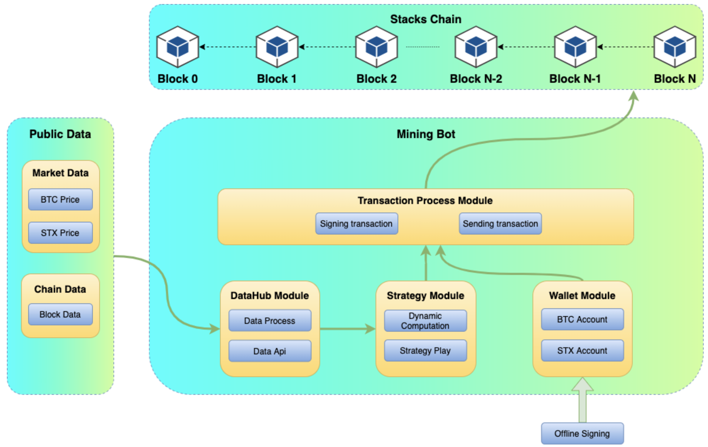

# mining-bot

## product architecture

Mining Bot includes a **stacks-blockchain node** which provides the feature to participate in the PoX consensus. A **mining-bot client** which have **Strategy Module** and **Wallet Module**. A **Public Data Client** which provides Market Data and Chain Data.

### stacks-blockchain node
- forked by stacks-blockchain
- expose API in PoX process
    - /v2/mining/btcAmount
        - set btc amount for mining process
    - /v2/mining/start
        - set mining-bot start mining
    - /v2/mining/stop
        - set mining-bot stop mining

### public data
- BTC/STX Price
    - Using binance API
        - https://api.binance.com/api/v3/avgPrice?symbol=STXUSDT
        - https://api.binance.com/api/v3/avgPrice?symbol=STXBTC
- Chain Data(https://blockstack.github.io/stacks-blockchain-api/)
    - Block Data(Block Height)
    - Btc amount burned in lastest Block(not available)

### mining-bot Client

- integrate public Data and PoX API 
- frontend client